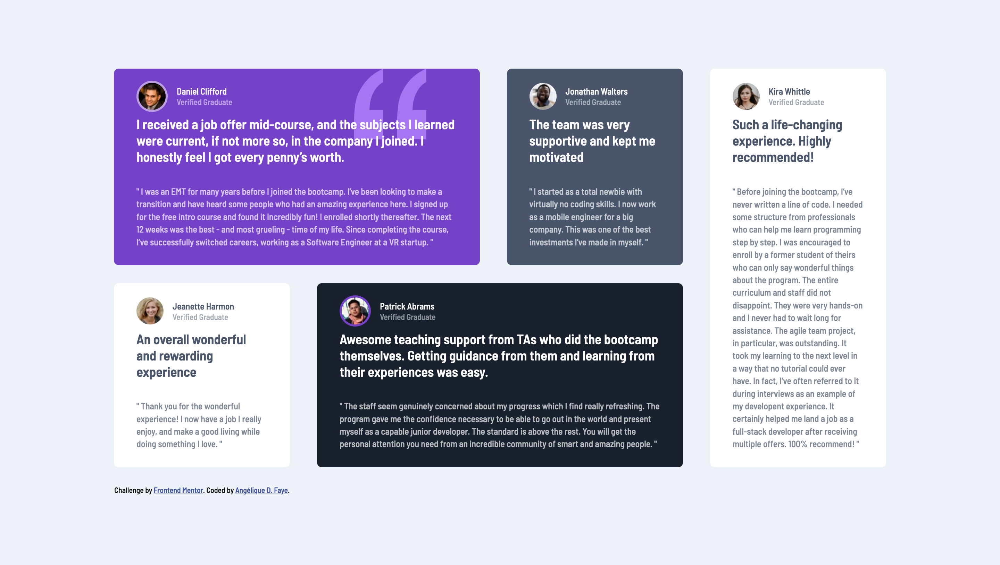

# Frontend Mentor - Testimonials grid section solution

This is a solution to the [Testimonials grid section challenge on Frontend Mentor](https://www.frontendmentor.io/challenges/testimonials-grid-section-Nnw6J7Un7). Frontend Mentor challenges help you improve your coding skills by building realistic projects.

## Table of contents

-   [Overview](#overview)
    -   [The challenge](#the-challenge)
    -   [Screenshot](#screenshot)
    -   [Links](#links)
-   [My process](#my-process)
    -   [Built with](#built-with)
    -   [What I learned](#what-i-learned)
    -   [Continued development](#continued-development)
    -   [Useful resources](#useful-resources)
-   [Author](#author)

**Note: Delete this note and update the table of contents based on what sections you keep.**

## Overview

### The challenge

Users should be able to:

-   View the optimal layout for the site depending on their device's screen size

### Screenshot



### Links

-   Solution URL: [Add solution URL here](https://your-solution-url.com)
-   Live Site URL: [Add live site URL here](https://your-live-site-url.com)

## My process

### Built with

-   Semantic HTML5 markup
-   CSS custom properties
-   Flexbox
-   CSS Grid

### What I learned

This project helped me practice using CSS Grid combined with CSS Flexible Box (Flexbox) for simple layouts, outside of a learning platform:

```css
/* container */
body {
	display: grid;
	grid-template-columns: 3fr 6.5fr 6fr 6.5fr 6.5fr 3fr;
	column-gap: 3rem;
	grid-template-rows: 5rem 0.33fr 0.33fr 5rem;
	row-gap: 2rem;
}
```

```css
/* one child element */
body > article:first-child {
	grid-column-start: 2;
	grid-column-end: 4;
	grid-row-start: 2;
	grid-row-end: 3;
}
```

### Continued development

Next, I would like to use CSS Grid on more complex layouts.

### Useful resources

-   [A Complete Guide to Grid on CSS-Tricks.com.](https://css-tricks.com/snippets/css/complete-guide-grid/)

## Author

-   Website - [Angélique D. Faye](https://adf.dev)
-   Frontend Mentor - [@AngeliqueDF](https://www.frontendmentor.io/profile/AngeliqueDF)
